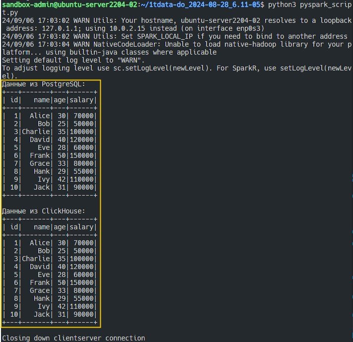

# Итоговая аттестация. Задание 5

Торшин Сергей

## Запуск 

1. Загрузить репозиторий:
    ```bash
    git clone https://github.com/torshin5ergey/1tdata-do_2024-08-28_6.11-05.git
    ```
2. Перейти в директорию репозитория:
    ```bash
    cd 1tdata-do_2024-08-28_6.11-05
    ```
3. Установить Java Development Kit (JDK). *Необходимо для использования JDBC*
    ```bash
    sudo apt update && sudo apt install default-jdk
    ```
4. Загрузить драйвер JDBC для PostgreSQL:
    ```bash
    curl -O https://jdbc.postgresql.org/download/postgresql-42.7.4.jar
    ```
5. Установить зависимости:
    ```
    pip install -r requirements.txt
    ```
6. Запустить мультиконтейнерное приложение:
    ```bash
    docker compose up
    ```
7. Запустить Python скрипт:
    ```bash
    python pyspark_script.py
    ```

## Результат

Результат выполнения задания показан на рисунке ниже.


